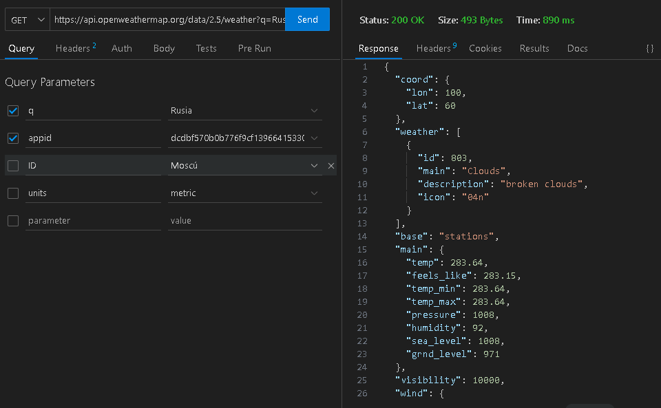
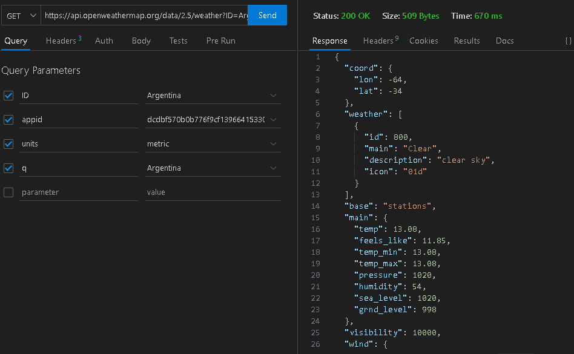
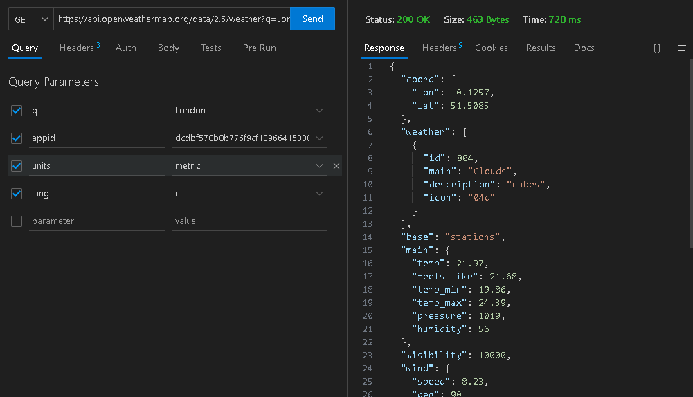
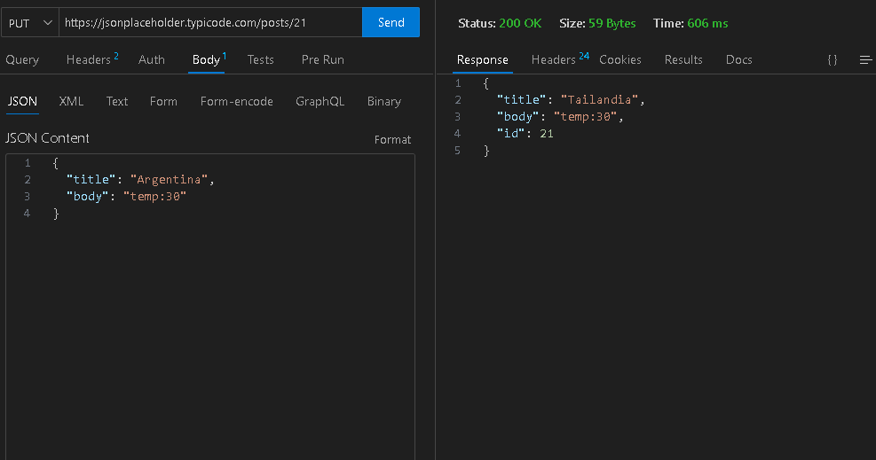

# Informe de API - Apellido_Nombre

## Descripción de la API

La API seleccionada es [OpenWeatherMap], que proporciona [informacion de los datos meteorologicos del país que querramos]. A continuación se detallan las características principales de la API:

- **URL base**: [[URL base de la API](https://api.openweathermap.org/data/2.5/weather)]
- **Métodos de solicitud admitidos**: GET, POST, PUT, DELETE
- **Puntos finales disponibles**: [lista de puntos finales disponibles]
- **Parámetros de consulta**: [descripción de los parámetros de consulta admitidos]
- **Encabezados necesarios**: [lista de encabezados necesarios]

## Capturas de pantalla

### Consulta GET 

### Consulta POST

### Consulta PUT

## Conclusión

En conclusión, la API [OpenWeatherMap] ofrece [informacion sobre los datos meteorologicos de cualquier pais en especifico ya sea temperatura, la contaminacion del aire, la velocidad del viento,etc.].

## Bibliografía

- Documentación oficial de [OpenWeatherMap]: [[enlace a la documentación oficial](https://home.openweathermap.org/api_keys)]

